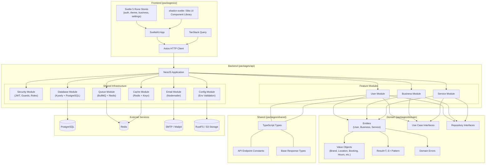
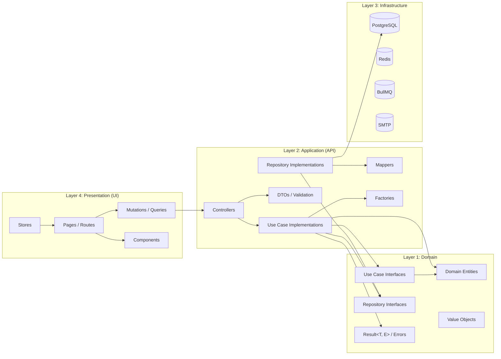
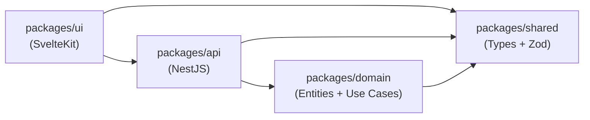
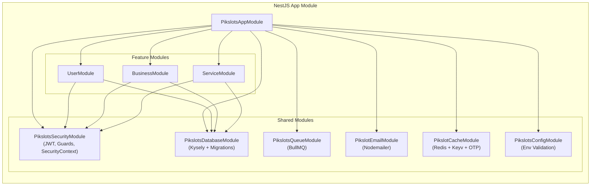
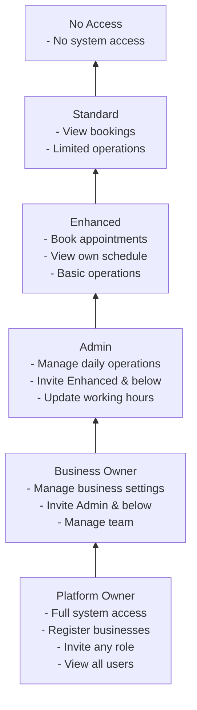
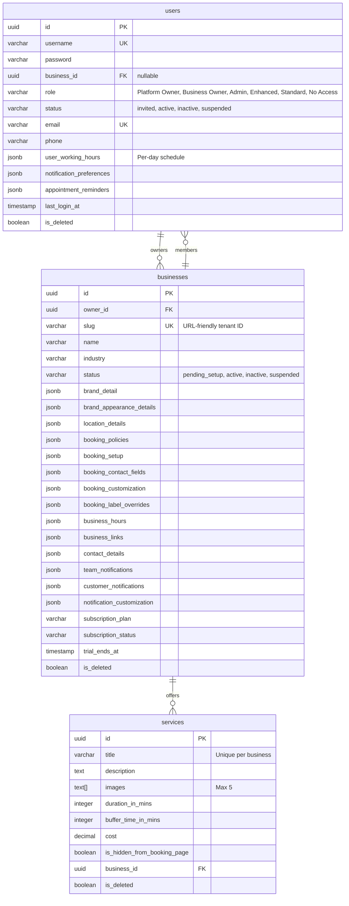
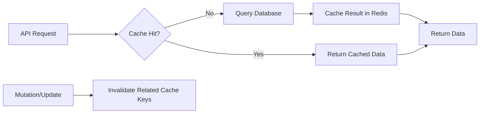

# Architecture Overview

## High-Level Architecture



## Clean Architecture Layers



## Request Flow

```mermaid
sequenceDiagram
    participant U as Browser (SvelteKit)
    participant A as Axios Client
    participant MW as JWT Middleware
    participant G as RolesGuard
    participant CTRL as Controller
    participant UC as Use Case
    participant ENT as Domain Entity
    participant REPO as Repository
    participant DB as PostgreSQL
    participant R as Redis

    U->>A: User Action (e.g., Save Settings)
    A->>A: Attach JWT from Auth Store
    A->>MW: HTTP Request
    MW->>MW: Verify JWT
    MW->>MW: Populate SecurityContext
    
    MW->>G: Route to Guard
    G->>G: Check @Roles() decorator
    
    G->>CTRL: Forward to Handler
    CTRL->>CTRL: Validate DTO
    
    CTRL->>UC: Execute Use Case
    UC->>REPO: findById()
    REPO->>DB: SQL Query
    DB-->>REPO: Row
    REPO->>REPO: Map DB → Entity
    REPO-->>UC: Result&lt;Entity&gt;
    
    UC->>ENT: entity.updateFeature(data)
    ENT-->>UC: new Entity (immutable)
    
    UC->>REPO: repository.update(entity)
    REPO->>REPO: Map Entity → DB
    REPO->>DB: SQL UPDATE
    DB-->>REPO: Success
    REPO-->>UC: Result&lt;Entity&gt;
    
    UC-->>CTRL: Result&lt;Entity&gt;
    CTRL->>CTRL: Map Entity → Response
    CTRL->>R: Invalidate Cache
    CTRL-->>U: HTTP 200 + Response JSON
    U->>U: Update TanStack Query Cache
    U->>U: Update Business Store
    U->>U: Show Toast Notification
```

## Package Dependency Graph



## Module Architecture (NestJS)



## User Role Hierarchy



## Key Architecture Patterns

### 1. Clean Architecture
The **domain layer** (`packages/domain`) has zero framework dependencies. It contains entities, value objects, use case interfaces, and repository interfaces. The **API layer** (`packages/api`) implements these interfaces using NestJS and Kysely.

### 2. Repository Pattern
Data access is abstracted behind TypeScript interfaces:
- `IUserRepository` — user CRUD operations
- `IBusinessRepository` — business CRUD operations  
- `IServiceRepository` — service CRUD operations

Implementations use Kysely for type-safe SQL queries.

### 3. Result Pattern
Errors are returned as values via `Result<T, E>` discriminated union:
```typescript
type Result<T, E> = { ok: true; value: T } | { ok: false; error: E };
```
Domain errors are **never thrown** — they flow through `Result` types and are mapped to HTTP responses in controllers.

### 4. Immutable Entities
All entity update methods return **new instances** rather than mutating. Each update stamps `updatedAt: new Date()` and `updatedBy: value.updatedBy`:
```typescript
updateFeature(value: { ...; updatedBy: string }): Business {
    return new Business({ ...this.props, ...changes, updatedAt: new Date(), updatedBy: value.updatedBy });
}
```

### 5. DTO Pattern
Input validation happens at system boundaries using `class-validator` decorators on DTO classes. TypeScript types and Zod schemas in `packages/shared` keep API contracts synchronized between frontend and backend.

### 6. Factory Pattern
Use cases are composed via Factory classes per module, enabling clean dependency injection:
- `BusinessUseCaseFactory`
- `UserUseCaseFactory`

### 7. Global Auth Pipeline
1. `JwtVerificationMiddleware` (global) — extracts & verifies JWT, populates `SecurityContext`
2. `RolesGuard` — checks `@Roles()` decorator against JWT payload role

### 8. State Management (Frontend)
- **Client state**: Svelte 5 runes (`$state`, `$derived`, `$effect`) via custom stores
- **Server state**: TanStack Svelte Query (queries + mutations with automatic cache invalidation)

## Database Design



> **Note:** All tables include a full audit trail: `created_at`, `created_by`, `updated_at`, `updated_by`, `deleted_at`, `deleted_by`, `is_deleted`. Soft deletes are used throughout.

## Caching Strategy



Redis is used for:
- **OTP storage** (invite acceptance codes with TTL)
- **Business data caching** (Cacheable + Keyv)
- **BullMQ job queue** (email sending, async events)
