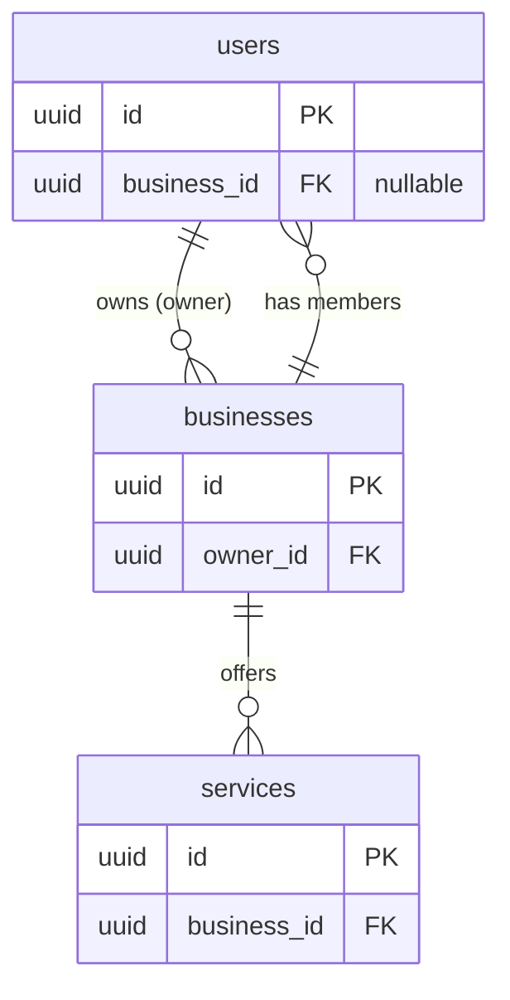

# Database Schema

## Overview

PostgreSQL database managed via **Kysely** migrations. All tables use **soft deletes** and **full audit trails**.

### Common Audit Fields

Every table includes these 7 audit fields:

| Column | Type | Description |
|---|---|---|
| `created_at` | `TIMESTAMP NOT NULL` | Row creation time |
| `created_by` | `UUID NOT NULL` | User who created the record |
| `updated_at` | `TIMESTAMP NOT NULL` | Last update time |
| `updated_by` | `UUID NOT NULL` | User who last updated |
| `deleted_at` | `TIMESTAMP` | Soft delete time (null = active) |
| `deleted_by` | `UUID` | User who deleted (null = active) |
| `is_deleted` | `BOOLEAN NOT NULL` | Soft delete flag |

## Tables

### `users`

Core user accounts with authentication, profile, and preferences.

| Column | Type | Constraints | Description |
|---|---|---|---|
| `id` | `UUID` | PK | Primary identifier |
| `username` | `VARCHAR` | UNIQUE, NOT NULL | Login username |
| `password` | `VARCHAR` | NOT NULL | bcrypt-hashed password |
| `business_id` | `UUID` | FK → businesses.id, NULLABLE | Associated business (null for Platform Owners) |
| `first_name` | `VARCHAR` | NOT NULL | |
| `last_name` | `VARCHAR` | NOT NULL | |
| `email` | `VARCHAR` | UNIQUE, NOT NULL | |
| `phone` | `VARCHAR` | NULLABLE | E.164 format |
| `role` | `VARCHAR` | NOT NULL | One of: `Platform Owner`, `Business Owner`, `Admin`, `Enhanced`, `Standard`, `No Access` |
| `status` | `VARCHAR` | NOT NULL | One of: `invited`, `active`, `inactive`, `suspended` |
| `avatar_url` | `VARCHAR` | NULLABLE | Profile picture URL |
| `email_verified` | `BOOLEAN` | NOT NULL, DEFAULT false | |
| `booking_url` | `VARCHAR` | NOT NULL | Public booking page URL |
| `notification_mode` | `VARCHAR` | NOT NULL, DEFAULT 'all' | `all`, `focus`, `none` |
| `notification_sound_enabled` | `BOOLEAN` | NOT NULL, DEFAULT true | |
| `notification_sound_type` | `VARCHAR` | NOT NULL, DEFAULT 'chime' | `chime`, `whistle` |
| `reminder_enabled` | `BOOLEAN` | NOT NULL, DEFAULT true | |
| `reminder_mins_before` | `INTEGER` | NOT NULL, DEFAULT 10 | |
| `reminder_sound_type` | `VARCHAR` | NOT NULL, DEFAULT 'chime' | `chime`, `whistle` |
| `user_working_hours` | `JSONB` | NOT NULL | Per-day schedule (see below) |
| `last_login_at` | `TIMESTAMP` | NULLABLE | |
| `suspended_reason` | `VARCHAR` | NULLABLE | |
| Audit fields (7) | | | created_at, created_by, updated_at, updated_by, deleted_at, deleted_by, is_deleted |

**`user_working_hours` JSONB structure:**
```json
{
  "monday":    { "enabled": true,  "openTime": "09:00", "closeTime": "17:00" },
  "tuesday":   { "enabled": true,  "openTime": "09:00", "closeTime": "17:00" },
  "wednesday": { "enabled": true,  "openTime": "09:00", "closeTime": "17:00" },
  "thursday":  { "enabled": true,  "openTime": "09:00", "closeTime": "17:00" },
  "friday":    { "enabled": true,  "openTime": "09:00", "closeTime": "17:00" },
  "saturday":  { "enabled": false, "openTime": "09:00", "closeTime": "17:00" },
  "sunday":    { "enabled": false, "openTime": "09:00", "closeTime": "17:00" }
}
```

### `businesses`

Multi-tenant business entities with extensive JSONB configuration.

| Column | Type | Constraints | Description |
|---|---|---|---|
| `id` | `UUID` | PK | |
| `owner_id` | `UUID` | FK → users.id, NOT NULL | Business owner reference |
| `slug` | `VARCHAR` | UNIQUE, NOT NULL | URL-friendly tenant identifier |
| `name` | `VARCHAR` | NOT NULL | Business display name |
| `industry` | `VARCHAR` | NOT NULL | See BusinessIndustry enum |
| `about` | `TEXT` | NOT NULL, DEFAULT '' | Business description |
| `appear_in_search_results` | `BOOLEAN` | NOT NULL, DEFAULT false | Search visibility |
| `status` | `VARCHAR` | NOT NULL | `pending_setup`, `active`, `inactive`, `suspended` |
| `suspended_reason` | `VARCHAR` | NULLABLE | |
| `brand_detail` | `JSONB` | NOT NULL | Logo + banner URLs |
| `brand_appearance_details` | `JSONB` | NOT NULL | Color, shape, theme, gallery |
| `location_details` | `JSONB` | NOT NULL | Address, currency, timezone, language |
| `booking_policies` | `JSONB` | NOT NULL | Lead time, schedule window, cancellation |
| `booking_setup` | `JSONB` | NOT NULL | Section visibility + booking behavior |
| `booking_contact_fields` | `JSONB` | NOT NULL | Field enabled/required + custom fields |
| `booking_customization` | `JSONB` | NOT NULL | Language, time format, display toggles |
| `booking_label_overrides` | `JSONB` | NOT NULL | Custom labels + T&Cs + redirect |
| `business_hours` | `JSONB` | NOT NULL | Per-day schedule |
| `business_links` | `JSONB` | NOT NULL | Social platform URLs |
| `contact_details` | `JSONB` | NOT NULL | Emails + phones |
| `team_notifications` | `JSONB` | NOT NULL | Notification prefs + CC emails |
| `customer_notifications` | `JSONB` | NOT NULL | Customer notification settings |
| `notification_customization` | `JSONB` | NOT NULL | Sender name + signature |
| `subscription_plan` | `VARCHAR` | NOT NULL, DEFAULT 'free' | `free`, `starter`, `pro`, `enterprise` |
| `subscription_status` | `VARCHAR` | NOT NULL, DEFAULT 'trialing' | `trialing`, `active`, `past_due`, `cancelled` |
| `trial_ends_at` | `TIMESTAMP` | NULLABLE | 14 days from creation |
| Audit fields (7) | | | |

### `services`

Services/classes offered by a business.

| Column | Type | Constraints | Description |
|---|---|---|---|
| `id` | `UUID` | PK | |
| `title` | `VARCHAR` | NOT NULL | Unique per business |
| `description` | `TEXT` | NOT NULL, DEFAULT '' | |
| `images` | `TEXT[]` | NOT NULL, DEFAULT '{}' | Array of URLs, max 5 |
| `duration_in_mins` | `INTEGER` | NOT NULL | |
| `buffer_time_in_mins` | `INTEGER` | NOT NULL | Gap between bookings |
| `cost` | `DECIMAL` | NOT NULL | |
| `is_hidden_from_booking_page` | `BOOLEAN` | NOT NULL, DEFAULT false | |
| `business_id` | `UUID` | FK → businesses.id, NOT NULL | |
| Audit fields (7) | | | |

## Relationships



- A **user** may own zero or one **business** (if role = Business Owner)
- A **user** may belong to a **business** (if business_id is set)
- A **Platform Owner** has `business_id = null`
- A **business** has many **users** (team members)
- A **business** has many **services**

## Enums

### UserRole
`Platform Owner` | `Business Owner` | `Admin` | `Enhanced` | `Standard` | `No Access`

### UserStatus
`invited` | `active` | `inactive` | `suspended`

### BusinessIndustry
`salon_and_beauty` | `health_and_wellness` | `fitness` | `medical` | `education` | `legal` | `financial` | `hospitality` | `retail` | `other`

### BusinessStatus
`pending_setup` | `active` | `inactive` | `suspended`

### SubscriptionPlan
`free` | `starter` | `pro` | `enterprise`

### SubscriptionStatus
`trialing` | `active` | `past_due` | `cancelled`

### BrandButtonShape
`rounded` | `pill` | `sharp`

### BrandTheme
`light` | `dark` | `system`

### SupportedCurrencies
`USD` | `PKR` | `RUB`

### WeekDay
`monday` | `tuesday` | `wednesday` | `thursday` | `friday` | `saturday` | `sunday`

### NotificationType
`email` | `sms`

### TimeUnit
`minutes` | `hours` | `days` | `weeks` | `months`

### SocialPlatforms
`Website` | `Facebook` | `Tiktok` | `X` | `Youtube` | `Instagram` | `LinkedIn`

## Migration Files

| File | Description |
|---|---|
| `20260524T101018-user_table.ts` | Creates `users` table |
| `20260525T104555-business_table.ts` | Creates `businesses` table |
| `20260606T054107-service_table.ts` | Creates `services` table |

### Creating a New Migration

```bash
# From packages/api directory
bunx kysely migrate:make migration_name
```

This creates a new migration file in `src/shared/database/migrations/`. Follow the existing pattern:

```typescript
import { Kysely, sql } from 'kysely';

export async function up(db: Kysely<any>): Promise<void> {
  await db.schema
    .createTable('table_name')
    .addColumn('id', 'uuid', (col) => col.primaryKey())
    // ... columns
    .addColumn('is_deleted', 'boolean', (col) => col.notNull().defaultTo(false))
    .execute();
}

export async function down(db: Kysely<any>): Promise<void> {
  await db.schema.dropTable('table_name').execute();
}
```

## Domain Entities (TypeScript)

The database schema is mirrored in domain entities in `packages/domain/src/`:

- **User entity**: `packages/domain/src/user/user.entity.ts`
- **Business entity**: `packages/domain/src/business/business.entity.ts`
- **Service entity**: `packages/domain/src/service/service.entity.ts`

Kysely table type definitions: `packages/api/src/shared/database/schema/`
