# Adding a New Feature

This guide covers the end-to-end process for adding a new business settings feature (e.g., "update X") from domain to UI. The complete detailed reference is in [`notes/feature-implementation-guide.md`](../../notes/feature-implementation-guide.md).

## High-Level Steps

```mermaid
flowchart LR
    D1["1. Domain - Use Case Interface"] --> D2["2. Domain - Entity Method"]
    D2 --> A1["3. API - Use Case Implementation"]
    A1 --> A2["4. API - Register Use Case"]
    A2 --> S1["5. Shared - Types & Endpoint"]
    S1 --> A3["6. API - DTO"]
    A3 --> A4["7. API - Swagger Docs"]
    A4 --> A5["8. API - Controller Method"]
    A5 --> U1["9. UI - Model Types"]
    U1 --> U2["10. UI - Mutation File"]
    U2 --> U3["11. UI - Svelte Component"]
```



## Step-by-Step Summary

### 1. Domain — Use Case Interface

**File:** `packages/domain/src/business/usecases/update.<feature>.usecase.ts`

Define the command interface and use case interface:
- `Update<Feature>Command` — input data (excluding `id`, that comes from URL)
- `Update<Feature>UseCase` — single `execute(command)` method returning `Result<Business, ...>`

Export from `packages/domain/src/business/usecases/index.ts`.

### 2. Domain — Entity Method

**File:** `packages/domain/src/business/business.entity.ts`

Add an immutable update method:
```typescript
update<Feature>(value: { ...fields; updatedBy: string }): Business {
  return new Business({
    ...this.props,
    // ...spread updated fields
    updatedAt: new Date(),
    updatedBy: value.updatedBy,
  });
}
```

**Rules:**
- Always return `new Business({ ...this.props, ...changes })`
- Always stamp `updatedAt: new Date()` and `updatedBy: value.updatedBy`
- For nested objects, replace the whole object (don't spread old one unless intentional)

### 3. API — Use Case Implementation

**File:** `packages/api/src/modules/business/usecases/update.<feature>.usecase.impl.ts`

- Inject `IBusinessRepository`
- `findById()` → call entity method → `update()` → return result
- Always use `businessRepository.update()` (SQL UPDATE), never `save()` (SQL INSERT)

### 4. API — Register the Use Case

- Add to `BUSINESS_USECASES` provider array in `packages/api/src/modules/business/usecases/index.ts`
- Add to `BusinessUseCaseFactory` in `packages/api/src/modules/business/factroy/business.usecases.factory.ts`

### 5. Shared — Types & Endpoint

- **Type:** Add `Update<Feature>Input` and `Update<Feature>Response` to `packages/shared/src/api/business/business.types.ts`
- **Endpoint:** Add `UPDATE_<FEATURE>` to `packages/shared/src/api/business/business.endpoints.ts`

### 6. API — DTO

**File:** `packages/api/src/modules/business/dto/update.business.<feature>.dto.ts`

Create a `class-validator` decorated DTO implementing the shared `Update<Feature>Input` interface. Available validators:

| Decorator | Usage |
|---|---|
| `@PikSlotsStringValidation(min, max)` | Required string |
| `@PikSlotsSlugValidation()` | URL-safe slug |
| `@PikSlotsEnumValidation(values[])` | Enum membership |
| `@PikSlotsUrlValidation()` | Required URL |
| `@PikSlotsOptionalUrlValidation()` | Optional URL |

### 7. API — Swagger Docs

**File:** `packages/api/src/modules/business/docs/business.controller.docs.ts`

Add a composed decorator with `@ApiOperation`, `@ApiParam`, `@ApiBody`, and `@ApiResponse`.

### 8. API — Controller Method

**File:** `packages/api/src/modules/business/business.controller.ts`

```typescript
@Update<Feature>Docs()
@UseGuards(RolesGuard)
@Roles('Platform Owner', 'Business Owner', 'Admin')
@Patch(':id/<feature-path>')
async update<Feature>(@Param('id') id: string, @Body() dto: Update<Feature>Dto) { ... }
```

**Gotcha:** Domain entity getter uses `brandApperanceDetails` (typo — one 'a') but shared/API uses `brandAppearanceDetails` (correct). Map explicitly in response.

### 9. UI — Model Types

**File:** `packages/ui/src/modules/api/business/models/business-model.ts`

```typescript
export type BusinessUpdate<Feature>Input = Update<Feature>Input & { id: string };
export type BusinessUpdate<Feature>Result = Update<Feature>Response;
```

### 10. UI — Mutation File

**File:** `packages/ui/src/modules/api/business/update.business.<feature>.mutation.ts`

Use `BUSINESS_ENDPOINTS.UPDATE_<FEATURE>` with Axios PATCH. Strip `id` from body before sending.

### 11. UI — Svelte Component

**Pattern:** See the detailed component template in [`notes/feature-implementation-guide.md`](../../notes/feature-implementation-guide.md#11-ui--svelte-component).

Key points:
- Local `$state` for form fields
- `$effect` to sync from `businessStore`
- `$derived` `isDirty` check
- `createMutation` for API call
- `$effect` to handle mutation result (update store, show toast)
- Save button disabled when not dirty or pending

## Key Conventions & Gotchas

| Thing | Rule |
|---|---|
| **Repository method for updates** | Always use `businessRepository.update()`, never `save()` (that's INSERT-only) |
| **Entity getter typo** | Domain has `brandApperanceDetails` (one 'a') — shared type has `brandAppearanceDetails` (correct). Map explicitly in controller. |
| **`id` in mutation input** | The `id` field is added only on the UI model type (`& { id: string }`). Strip it before sending to the API by destructuring `const { id, ...body } = input` |
| **Error map** | `mapBusinessError` in `business.errors.map.ts` handles all `BusinessError` kinds. No need to add new entries unless you introduce a new error kind. |
| **Roles** | Use `@Roles('Platform Owner', 'Business Owner', 'Admin')` for settings endpoints |
| **Gallery/array dirty check** | Use `JSON.stringify` comparison: `JSON.stringify(localArr) !== JSON.stringify(business.section.arr)` |
| **Immutable entity updates** | Entity methods return new instances; never mutate `this.props` |
