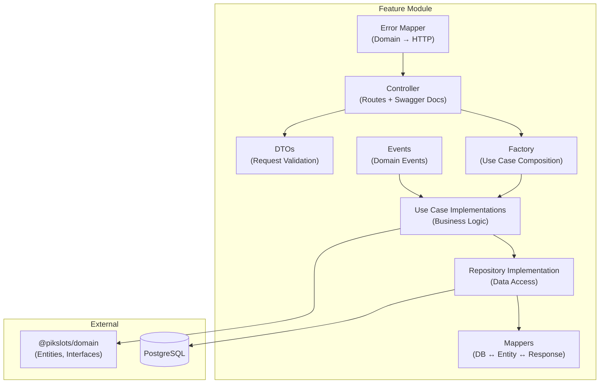

# Backend Guide

The backend is a **NestJS 11** application (`packages/api`) organized by feature modules, following Clean Architecture principles.

## Directory Structure

```
packages/api/src/
├── main.ts                              # Application bootstrap
├── pikslots.app.module.ts               # Root module
├── modules/
│   ├── user/                            # User management feature
│   │   ├── user.module.ts
│   │   ├── user.controller.ts           # REST controller
│   │   ├── docs/user.controller.docs.ts # Swagger decorators
│   │   ├── dto/                         # Request DTOs
│   │   ├── repository/                  # PostgreSQL repository implementation
│   │   ├── mappers/                     # DB ↔ Entity ↔ Response mappers
│   │   ├── usecases/                    # Use case implementations
│   │   ├── factory/                     # Use case factory
│   │   ├── events/                      # Domain events
│   │   ├── errors/                      # Domain error → HTTP error mapper
│   │   └── internal/                    # Internal helpers
│   ├── business/                        # Business management feature
│   │   └── (same structure as user/)
│   └── service/                         # Service management feature (partial)
│       ├── service.module.ts
│       ├── repository/
│       ├── mappers/
│       └── usecases/
└── shared/                              # Cross-cutting shared modules
    ├── config/                          # Environment config
    ├── database/                        # Kysely setup, schema types, migrations
    ├── security/                        # JWT, guards, middleware, security context
    ├── queue/                           # BullMQ job queue
    ├── email/                           # Nodemailer email service
    ├── cache/                           # Redis caching + OTP service
    ├── pipes/                           # Validation pipes
    ├── decorators/validations/          # Custom class-validator decorators
    └── types/                           # Base response types
```

## Module Structure (Per Feature)

Each feature module follows a consistent pattern:



## Creating a New Feature Module

### 1. Module Setup

```typescript
// modules/feature/feature.module.ts
import { Module } from '@nestjs/common';

@Module({
  imports: [],
  controllers: [FeatureController],
  providers: [
    ...FEATURE_USECASES,
    FeatureUseCaseFactory,
    {
      provide: IFeatureRepository,
      useClass: FeatureRepositoryImpl,
    },
  ],
  exports: [FeatureUseCaseFactory],
})
export class FeatureModule {}
```

### 2. Controller

```typescript
// modules/feature/feature.controller.ts
@Controller('features')
export class FeatureController {
  constructor(private readonly factory: FeatureUseCaseFactory) {}

  @Get()
  async findAll(): Promise<...> {
    const result = await this.factory.findFeaturesUseCase.execute();
    // handle result.ok / result.error
  }
}
```

### 3. Use Case Implementation

Use cases implement domain interfaces, use repositories, and return `Result<T, E>`:

```typescript
@Injectable()
export class FindFeaturesUseCaseImpl implements IFindFeaturesUseCase {
  constructor(
    @Inject(IFeatureRepository)
    private readonly repo: FeatureRepository,
  ) {}

  async execute(): Promise<Result<Feature[], InfrastructureError>> {
    return this.repo.findAll();
  }
}
```

### 4. Repository Implementation

Repositories map between DB rows (Kysely) and domain entities:

```typescript
@Injectable()
export class FeatureRepositoryImpl implements IFeatureRepository {
  constructor(@InjectDatabase() private readonly db: PikSlotsDatabase) {}

  async findAll(): Promise<Result<Feature[], InfrastructureError>> {
    try {
      const rows = await this.db.selectFrom('features').selectAll().execute();
      return ok(rows.map(Feature.reconstitute));
    } catch (error) {
      return err({ kind: 'infrastructure', message: 'DB query failed', timestamp: new Date(), cause: error });
    }
  }
}
```

## Authentication & Authorization

### JWT Verification (Global Middleware)

The `JwtVerificationMiddleware` runs on all routes (`*`). It:
1. Extracts the JWT from `Authorization: Bearer <token>`
2. Verifies the token signature and expiry
3. Populates `SecurityContext` with `userId`, `role`, `businessId`

### Role-Based Access Control

```typescript
@UseGuards(RolesGuard)
@Roles('Platform Owner', 'Business Owner', 'Admin')
@Patch(':id/settings')
async updateSettings(...) { ... }
```

### Role Hierarchy

| Role | Can Invite | Can Query | Can Update Working Hours |
|---|---|---|---|
| Platform Owner | All roles | All roles | Always |
| Business Owner | Admin, Enhanced, Standard, No Access | Admin, Enhanced, Standard, No Access | Same business |
| Admin | Enhanced, Standard, No Access | Enhanced, Standard, No Access | Same business |
| Enhanced | None | None | Self only |
| Standard | None | None | Self only |
| No Access | None | None | Never |

### Security Context

```typescript
// Request-scoped provider
@Injectable({ scope: Scope.REQUEST })
export class SecurityContext {
  userId: string;
  role: UserRole;
  businessId: string | null;
}
```

## Database

### Technology: Kysely (Type-Safe SQL)

Kysely provides type-safe SQL queries with full TypeScript inference of table schemas.

### Migration System

Migrations are TypeScript files in `src/shared/database/migrations/`:

```bash
# Create a new migration (from packages/api)
bunx kysely migrate:make add_feature_table

# Run pending migrations
bunx nx run api:migration:run
```

### Database Type Definitions

Table types are defined in `src/shared/database/schema/`:

```typescript
// schema/feature.table.ts
export interface FeatureTable {
  id: string;
  business_id: string;
  title: string;
  // ... other columns
  // audit fields (from audit.table.ts)
  created_at: Date;
  created_by: string;
  updated_at: Date;
  updated_by: string;
  deleted_at: Date | null;
  deleted_by: string | null;
  is_deleted: boolean;
}
```

The `PikSlotsDatabase` interface in `schema/index.ts` aggregates all table types for type-safe queries.

## Caching

Redis-backed caching via Cacheable + Keyv:

```typescript
@Injectable()
export class FeatureService {
  constructor(
    @Inject(CACHE_INSTANCE)
    private readonly cache: Cacheable,
  ) {}

  async getFeature(id: string): Promise<Feature> {
    return this.cache.get(`feature:${id}`, async () => {
      return this.repo.findById(id);
    });
  }
}
```

## Queue (BullMQ)

Background job processing for async operations:

```typescript
// Queue workers process:
// - Email sending (invites, notifications)
// - Business event handling
// - User event handling
```

Jobs are defined in `src/shared/queue/jobs/`.

## Email

Nodemailer-based email sending via SMTP. Uses Mailpit in development for email inspection.

```typescript
@Injectable()
export class PikslotEmailService {
  async sendInviteEmail(email: string, token: string): Promise<void> {
    // Send invite link with JWT token
  }
}
```

## Custom Validation Decorators

Located in `src/shared/decorators/validations/`:

| Decorator | Description |
|---|---|
| `@PikSlotsStringValidation(min, max)` | Required string with length bounds |
| `@PikSlotsSlugValidation()` | URL-safe slug |
| `@PikSlotsEnumValidation(values[])` | Enum membership |
| `@PikSlotsUrlValidation()` | Required URL |
| `@PikSlotsOptionalUrlValidation()` | Optional URL (skips if null) |
| `@PikSlotsEmailValidation()` | Email format |
| `@PikSlotsPhoneValidation()` | E.164 phone format |
| `@PikSlotsPasswordValidation()` | Password strength |
| `@PikSlotsTimezoneValidation()` | Valid IANA timezone |
| `@PikSlotsUUIDValidation()` | UUID v4 format |

## API Conventions

### Response Format

All API responses follow a standard wrapper:

```typescript
// Success
class PikslotsBaseResponse<T> {
  data: T;
  statusCode: number;
  timestamp: string;
}

// Error
class PikslotsBaseErrorResponse {
  statusCode: number;
  message: string;
  error: string;
  timestamp: string;
}
```

### Error Mapping

Domain errors are mapped to HTTP status codes in `errors/<module>.errors.map.ts`:

| Domain Error | HTTP Status |
|---|---|
| `InfrastructureError` | 500 Internal Server Error |
| `NotFoundError` | 404 Not Found |
| `ConflictError` | 409 Conflict |
| `ValidationError` | 400 Bad Request |
| `UnauthorizedError` | 403 Forbidden |
