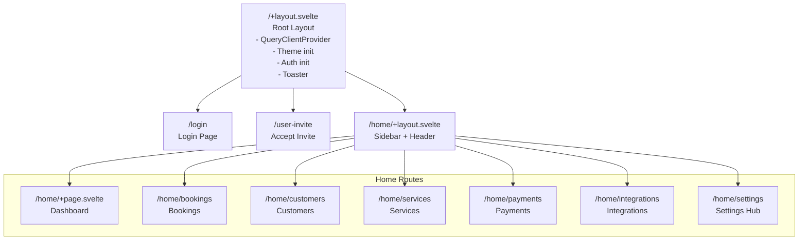
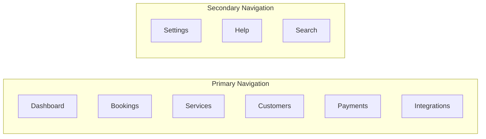

# Frontend Guide

The frontend is a **SvelteKit 2** application (`packages/ui`) with a static adapter, using **Tailwind CSS v4** for styling and **shadcn-svelte** for UI components.

## Directory Structure

```
packages/ui/src/
├── app.html                    # HTML shell
├── routes/                     # SvelteKit file-based routing
│   ├── +layout.svelte          # Root layout (QueryClient, Auth, Theme, Toaster)
│   ├── +page.svelte            # Redirects to /home
│   ├── layout.css              # Global CSS
│   ├── login/
│   │   └── +page.svelte        # Login page
│   ├── user-invite/
│   │   ├── +page.svelte        # Accept invite page
│   │   └── +page.ts            # Load function (reads invite token)
│   └── home/
│       ├── +layout.svelte       # Home layout (sidebar + header + content)
│       ├── +page.svelte         # Dashboard
│       ├── bookings/
│       ├── customers/
│       ├── services/
│       ├── payments/
│       ├── integrations/
│       └── settings/            # Full settings hierarchy
├── modules/                     # Feature modules
│   ├── api/                     # API client (TanStack Query mutations + queries)
│   ├── core/store/              # Svelte 5 rune stores
│   ├── login/                   # Login module
│   ├── user-invite/             # Invite acceptance module
│   ├── home/                    # Dashboard module
│   └── settings/                # Settings modules (brand, team, notifications, etc.)
└── lib/
    ├── components/ui/           # shadcn-svelte UI components
    ├── components/              # App-specific components
    ├── http/                    # Axios client with interceptors
    └── utils.ts                 # Utility functions
```

## Routing



## Settings Route Hierarchy

```
/home/settings
├── brand/                          # Brand settings hub
│   ├── brand-details/              # Logo, banner, name, slug, industry, about
│   ├── appearance/                 # Color, button shape, theme, gallery
│   ├── location/                   # Address, city, state, zip, country, currency
│   ├── contact/                    # Primary email, phone, additional contacts
│   ├── business-hours/             # Per-day open/close times
│   └── links/                      # Social media links
├── booking-preferences/
│   ├── booking-policies/           # Lead time, schedule window, cancellation
│   ├── booking-setup/              # Section visibility, booking behavior toggles
│   ├── booking-page-visibility/    # Search visibility
│   └── customization/              # Language, time format, labels, T&Cs, redirect
├── team/                           # Team management
├── general/                        # General settings (language)
├── notifications/
│   ├── your-notifications/         # User notification preferences
│   ├── team-notifications/         # Team notification settings
│   ├── customer-notifications/     # Customer notification settings
│   └── customization/              # Email sender name, signature
├── profile/                        # User profile
├── security/                       # Security settings
├── reports/                        # Reports
├── reviews/                        # Reviews
└── payments/
    ├── booking-page-payments/      # Booking page payment integration
    ├── payment-integrations/       # Payment gateway connections
    └── payments-history/           # Payment history
```

## State Management

### Svelte 5 Rune Stores

Client-side state is managed using Svelte 5 runes (`$state`, `$derived`, `$effect`):

```typescript
// modules/core/store/auth.svelte.ts
class AuthStore {
  accessToken = $state<string | null>(null);
  isAuthenticated = $derived(this.accessToken !== null);

  setToken(token: string | null) {
    this.accessToken = token;
  }
}
export const authStore = new AuthStore();
```

### Available Stores

| Store | File | Purpose |
|---|---|---|
| `authStore` | `modules/core/store/auth.svelte.ts` | JWT access token, auth state |
| `themeStore` | `modules/core/store/theme.svelte.ts` | Light/dark/system theme |
| `businessStore` | `modules/core/store/business.svelte.ts` | Selected business context |
| `settingsStore` | `modules/core/store/settings.svelte.ts` | Settings sidebar state |

## Data Fetching

### TanStack Svelte Query + Axios

Server state is managed via TanStack Svelte Query with Axios as the HTTP client.

### Query Pattern

```typescript
// modules/api/business/get.business.by.id.query.ts
import { createQuery } from '@tanstack/svelte-query';
import { apiClient } from '$lib/http/axios';

export const getBusinessByIdQueryOptions = (id: string) =>
  queryOptions({
    queryKey: ['business', id],
    queryFn: async () => {
      const { data } = await apiClient.get(`/businesses/${id}`);
      return data.data;
    },
  });

// In a component:
const query = createQuery(() => getBusinessByIdQueryOptions(businessId));
```

### Mutation Pattern

```typescript
// modules/api/business/update.business.brand.details.mutation.ts
import { mutationOptions } from '@tanstack/svelte-query';
import { apiClient } from '$lib/http/axios';

export const updateBrandDetailsMutationOptions = () =>
  mutationOptions({
    mutationKey: ['update-business-brand-details'],
    mutationFn: async (input) => {
      const { id, ...body } = input;
      const { data } = await apiClient.patch(`/businesses/${id}/brand-details`, body);
      return data.data;
    },
  });

// In a component:
const mutation = createMutation(() => updateBrandDetailsMutationOptions());
```

### Axios Interceptors

The Axios client (`src/lib/http/axios.ts`) includes interceptors for:
- Request: Attach `Authorization: Bearer <token>` header
- Response: Auto-refresh expired tokens using refresh token cookie

## Component Pattern (Settings Form)

Settings pages follow a consistent pattern:

```svelte
<script lang="ts">
  import { createMutation } from '@tanstack/svelte-query';
  import { businessStore } from '../../../core/store/business.svelte';
  import { toast } from 'svelte-sonner';

  const business = $derived(businessStore.selectedBusiness);

  // 1. Local state
  let fieldA = $state('');
  let fieldB = $state('');

  // 2. Sync from store
  $effect(() => {
    if (business) {
      fieldA = business.someSection.fieldA;
      fieldB = business.someSection.fieldB;
    }
  });

  // 3. Dirty check
  const isDirty = $derived(
    !!business && (fieldA !== business.someSection.fieldA || fieldB !== business.someSection.fieldB)
  );

  // 4. Mutation
  const mutation = createMutation(() => updateSomethingMutationOptions());

  // 5. React to result
  $effect(() => {
    if (mutation.data) {
      businessStore.setSelectedBusiness(mutation.data);
      toast.success('Saved successfully.');
    }
    if (mutation.isError) {
      toast.error(mutation.error?.response?.data?.message ?? 'Failed to save.');
    }
  });

  function handleSave() {
    if (!business) return;
    mutation.mutate({ id: business.id, fieldA, fieldB });
  }
</script>

<Button onclick={handleSave} disabled={!isDirty || mutation.isPending}>
  {mutation.isPending ? 'Saving...' : 'Save'}
</Button>
```

## Navigation Menu

The navigation menu is defined in `modules/home/nav-menu/menu.ts` and drives the sidebar:



## UI Component Library

Built with **shadcn-svelte** + **Bits UI**:

| Component | Usage |
|---|---|
| Button, Input, Label | Form controls |
| Badge, Card | Display elements |
| Select, Switch, Checkbox, Toggle | Input controls |
| Tabs, Accordion | Navigation |
| Table, DataTable | Data display |
| Sheet, Drawer, DropdownMenu | Overlays |
| Tooltip, Popover | Hints |
| Avatar | User display |
| Skeleton, Empty | Loading/empty states |
| Chart | D3-based charts via Layerchart |
| Sidebar | Layout navigation |

## Key Conventions

| Convention | Rule |
|---|---|
| **Settings forms** | Always use dirty checking + save button pattern |
| **Store updates** | Call `businessStore.setSelectedBusiness()` after mutation success |
| **Gallery/array dirty** | Use `JSON.stringify` comparison |
| **Mutation input `id`** | Add `id` only on UI model, strip before API call |
| **Toast notifications** | Use `svelte-sonner` for success/error feedback |
| **Form validation** | Zod schemas + sveltekit-superforms |
